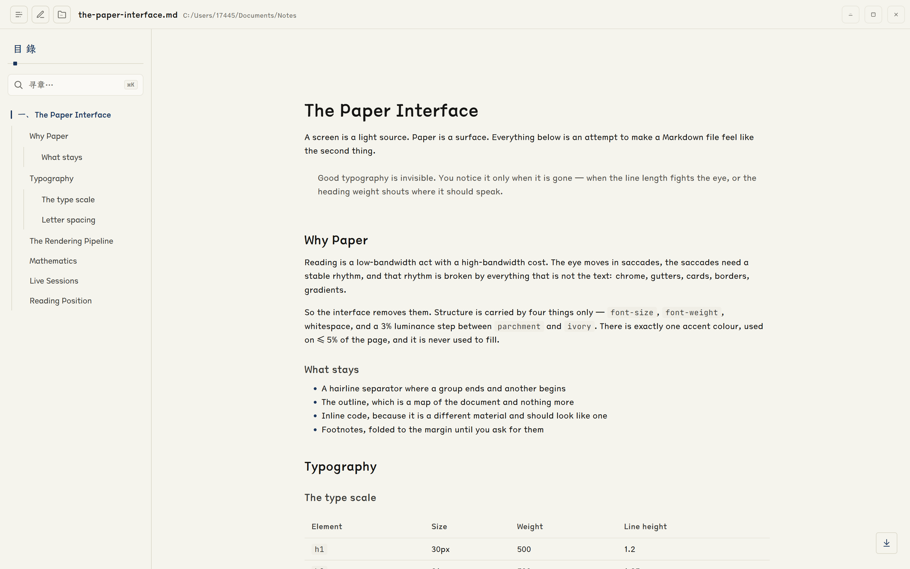
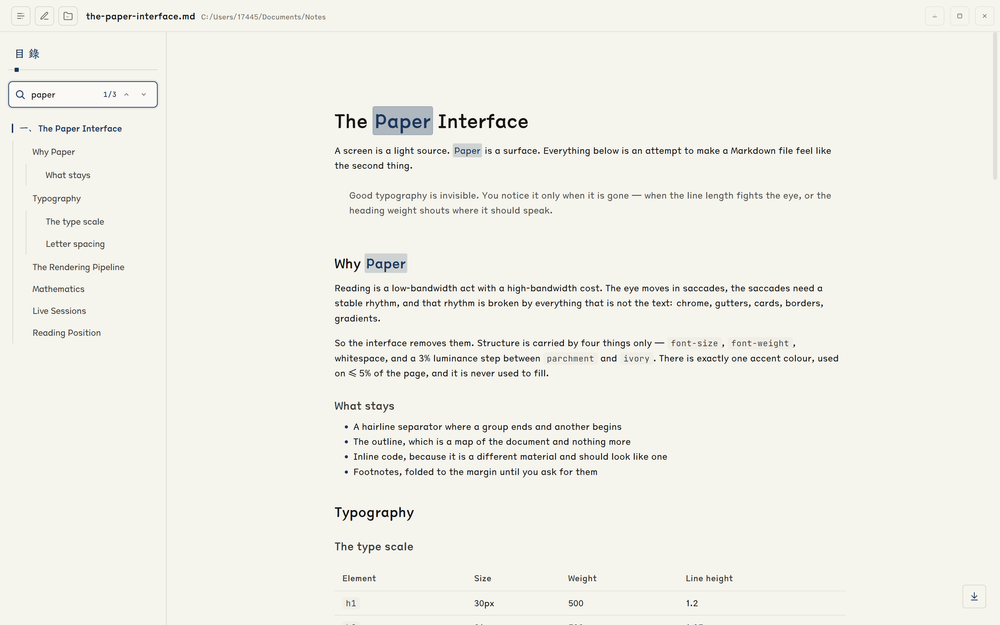
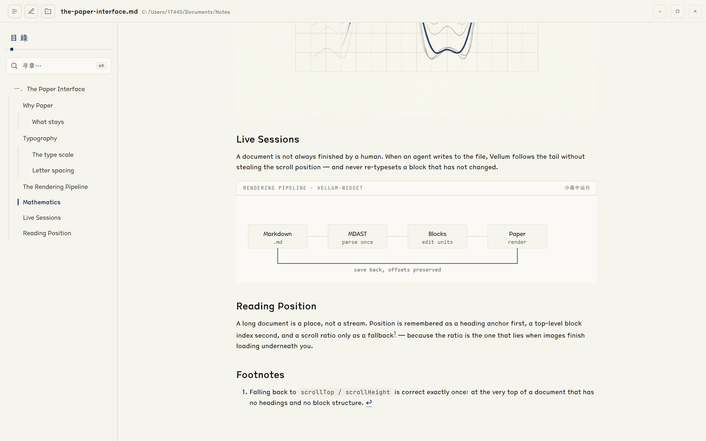

# Vellum · 素笺

_A warm, parchment-toned Markdown viewer for Windows._

**给 Markdown 一张纸。** 暖纸底色、今楷正文、一笔靛青 —— 一个把长文档认真排出来的窗口。

  
  
  

[下载](https://github.com/HwFee/vellum/releases) ·
[落地页](./promo/index.html) ·
[设计语言](./DESIGN.md) ·
[更新日志](./CHANGELOG.md)

## Download

The easiest way to get started is to download the latest installer from
[GitHub Releases](https://github.com/HwFee/vellum/releases).

A single Windows installer is provided:

- **NSIS Setup** — `Vellum_<版本>_x64-setup.exe`
  单用户轻量安装。

The installer automatically registers `.md` and `.markdown` file associations, so you can open
Markdown files directly from File Explorer.

> **Platform note:** Vellum · 素笺 is currently built and tested for **Windows 10/11 x64** only.

## Features

### 读 · Reading

- **纸墨排版。** 正文 14px / 1.55 行高 / 0.4px 字距，列宽 `min(800px, 100%)` 居中；
  层级只靠字号、字重、留白与 ivory 填充承担——标题没有前导短线，引用没有侧线，表格默认没有斑马纹。
- **GitHub Flavored Markdown。** 表格、任务列表、删除线、引用、围栏代码，以及脚注。
- **数学公式。** KaTeX 行内与行间公式，含 Pandoc 式货币保护（`$5 和 $10` 不会被误判成公式）。
- **代码高亮。** 20 种常用语言（PrismLight，不会为每种语言生成 chunk），带语言标签与复制按钮。
- **本地图片与 GIF。** 相对路径按文档位置解析，GIF 保持动画。
- **安全 raw HTML。** 放行常见排版标签后再净化。
- **6px 自定义滚动条**，平时透明、滚动时淡入；距底超过 300px 时右下角浮现跳底按钮。

### 寻 · Finding

- **大纲。** h1–h3 收成左侧目录，随正文滚动实时高亮当前章节，点击缓动跳转。
- **全文检索。** <kbd>Ctrl</kbd>+<kbd>K</kbd> 聚焦，匹配项在正文里就地高亮，上一个 / 下一个逐个跳。
- **可调侧栏。** 200–320px 拖拽调宽，双击手柄复位；窄屏自动收成浮层。
- **文档内锚点。** `[文字](#id)` 由应用接管：缓动滚到目标并顺带点亮大纲，不改写 URL 与历史。
- **阅读位置记忆。** 标题锚点 → 顶层块序号 → 比例兜底的三级记录，图片与字体把版面撑开时持续重锚。
- **换版不跳位。** 开关侧栏 / 拖宽会改正文宽度、整篇重排，此时用视口锚点钉住你正在看的那一行
  （Chromium 原生滚动锚定不补偿「行内尺寸变化驱动的重排」，这一步必须自己做）。

### 写 · Writing

- **块级就地编辑。** <kbd>Ctrl</kbd>+<kbd>E</kbd> 进入编辑视图，点任意可编辑块直接改——
  不动版式、不切分屏：源码覆盖层与渲染态同字号同行高，草稿变长就自增高把下文推下去。
- **编辑信号在页边。** hover 浮出淡 `¶`；只读块（原生 HTML / 交互块）常驻灰 `×`；
  正在编辑的块由一道靛青边轨与页边的 `¶` 标记，正文本身保持阅读时的样子。
- **提交即落盘。** <kbd>Ctrl</kbd>+<kbd>S</kbd> 或失焦提交，临时文件 + 原子重命名写回；
  外部改动与自身回声都能识别，不误判、不覆盖。
- **记录中只读。** mdlog 记录期间禁止编辑（入口、提交口、Rust 侧三重门禁）。

### 流 · Streaming

- **mdlog 现场日志。** 连接建立后 agent 每写一段，文档尾部就多一段——不抢你的滚动位置，
  不重打没有变化的块。
- **沙箱交互块。** 文档里的 `vellum-widget` 代码块渲染成跨源 iframe 里的实时界面；
  全局最多保留 10 个存活窗口，离屏停帧降载、滑回来自动恢复。
- **信任台账。** 交互块默认停在占位块上；点过一次 `[点击加载]`，这一份内容就被记住
  （按源码指纹落盘），换文档、热重载、重启应用都不必再点第二次。

### 底子 · Foundations

- **Tauri 2 + WebView2。** 约 21 MB 安装包；无框原生窗口，整栏可拖拽，方形窗口控制件。
- **多实例。** 双击几个 `.md` 就开几个窗口，各自加载各自的文档，阅读位置按文件路径键控。
- **离线优先。** 没有云、没有账号、不联网；打开的是磁盘上的那个文件，写回的也是它。
- **真机验收。** 数学 / 搜索 / 编辑 / 滚动这类热路径都有 CDP 真机探针与回归测试
  （38 个测试文件 / 766 个用例）。

## Usage

1. Run the installer and finish setup.
2. Double-click any `.md` or `.markdown` file in File Explorer.
3. To open another file, click the folder icon in the top-right corner.
4. Press <kbd>Ctrl</kbd>+<kbd>E</kbd> to edit in place, <kbd>Ctrl</kbd>+<kbd>K</kbd> to search.

## System Requirements

- Windows 10 version 1809+ or Windows 11
- 64-bit (x64) processor
- WebView2 runtime (pre-installed on most modern Windows systems)

## Tech Stack

- [Tauri 2](https://tauri.app/) — Rust-powered desktop framework
- [React 19](https://react.dev/) — UI layer
- [react-markdown](https://github.com/remarkjs/react-markdown) — Markdown parsing
- [remark-math](https://github.com/remarkjs/remark-math) + [KaTeX](https://katex.org/) — mathematics
- [react-syntax-highlighter](https://github.com/react-syntax-highlighter/react-syntax-highlighter) — code highlighting
- [TypeScript](https://www.typescriptlang.org/) — type safety across the frontend
- [Cargo](https://doc.rust-lang.org/cargo/) / [Rust](https://www.rust-lang.org/) — native backend and asset resolution

## Credits

The visual language — warm paper tones, serif body type, and restrained navy accents — is directly
inspired by **[Kami](https://github.com/tw93/kami)**, Tw93's beautiful document system.
Vellum · 素笺 brings that same reading feeling to Markdown files on Windows.
Body type is set in **仓耳今楷 TsangerJinKai02**, code in **JetBrains Mono**.

## License

MIT

---

Built for focused reading.
