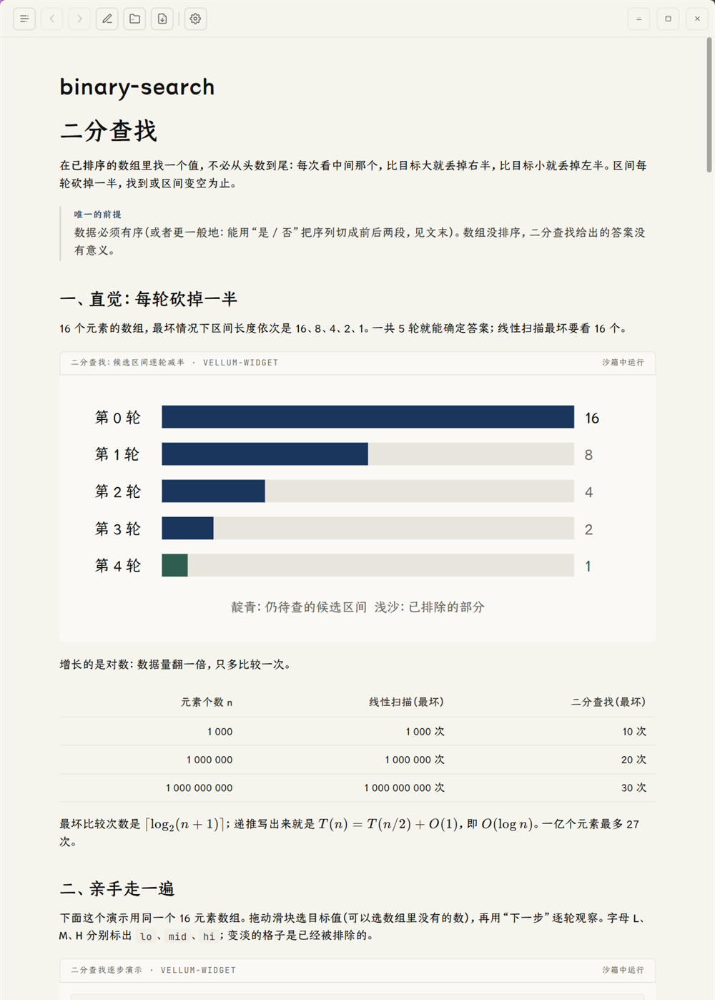
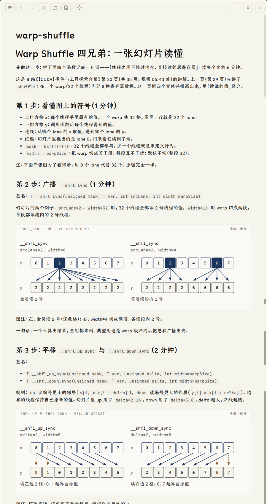

# 让 Agent 写出带图和演示的 Markdown：`vellum-widget-md`

普通 Markdown 讲不清的东西——流程、结构、「拖一下看会怎样」——可以写成 Markdown 里的一个围栏，Vellum 把它渲染成图或可点的演示。`vellum-widget-md` 是教 Agent 写这种文档的技能：什么时候该画图、怎么画、怎么检查、怎么交给你。

> **在 GitHub 上看不到演示。** 图与交互是 Vellum 渲染的，GitHub 只会把围栏当成代码块。下面用截图说明效果；想看真的，用 Vellum 打开 [`samples/`](../samples/) 里的文件。

## 看效果

两篇都是 Agent 按这个技能一次写成的，没有手工改动。

**[二分查找](../samples/binary-search.md)**：一张条形图讲「每轮减半」，一个可拖动的逐步演示，加表格、公式、代码和练习。



**[Warp Shuffle 四兄弟](../samples/warp-shuffle.md)**：把一页 CUDA 幻灯片讲成 4 个步骤，三张静态图并排对比 `shfl` / `up` / `down` / `xor` 四个函数读谁的值。



## 怎么用

在 Vellum 仓库里启动 pi，对 Agent 说：

```text
用 vellum-widget-md 写一篇二分查找的讲解，保存到 samples/binary-search.md。
```

不需要连接 mdlog，也不需要任何配置。技能由仓库里的 `.pi/settings.json` 声明加载，实体在 [`pi/skills/vellum-widget-md/`](../pi/skills/vellum-widget-md/)。

写完用 Vellum 打开文件。**文档里的每个演示第一次会停在「交互内容 · 点击加载」**，点一次才运行；同一份内容之后会被记住，换文档、重启都不用再点。

## 它做了什么

技能把工作收成五步，每步有明确的完成标准：

| 步骤 | 做什么 | 完成标准 |
|---|---|---|
| 1 选形态 | 在四级里选最低够用的 | 形态已命名，更低几级已排除 |
| 2 起草 | 从模板起手，写进临时文件 | 草稿存在，以 `<!DOCTYPE html>` 开头 |
| 3 自查 | 先看语义（箭头方向、标签歧义），再看几何（字超框、连线穿字） | 逐项有答案 |
| 4 检查 | 跑检查脚本 | 退出码 0，警告逐条处理 |
| 5 交付 | 写进围栏，整篇再检查一遍 | 通过，并告诉你需要点一下加载 |

### 能力阶梯：能用低一级的，就不上高一级

| 形态 | 能做 | 做不到 |
|---|---|---|
| 原生 Markdown | 表格、公式、callout、任务列表、代码高亮 | 图、可调参数 |
| 内联 HTML | 折叠、轻量排版 | `style`、`<svg>`、`<button>` 会被 Vellum 剥掉 |
| 静态 widget | 结构图、流程、时序、对比、分布 | 随输入变化 |
| 交互 widget | 参数探索、逐步演化、拖动 | 联网、持久化 |

数量上，每篇文档交互演示至多 1 个，其余用静态图。

### 为什么要检查脚本

演示是一个自包含的 HTML 页面，跑在隔离沙箱里，写错了不会报错，只是不显示或显示得很怪。所以 `check-widgets.mjs` 把容易踩的坑变成机器可查的规则：

- 围栏标识写错（写成 `html` 会渲染成普通代码块）。
- 缺高度上报代码，演示高度会塌成 0。
- 用了 `localStorage` 或 `fetch`：沙箱里前者直接抛错，后者被安全策略拦截。
- 缺 `prefers-reduced-motion`、字号太小、用了 emoji。
- 整份围栏超过 512KB。
- 画图时文字溢出方框、连线穿过文字（交给 `svg-lint` 做几何检查）。

```bash
node pi/skills/vellum-widget-md/tools/check-widgets.mjs samples/binary-search.md
```

## 边界

- 它用于写**会在 Vellum 里读**的文档：教程、讲义、图解、演示页。
- 仓库文档（README、`docs/`）和平铺直叙的随手笔记不适用——读者不一定有 Vellum，围栏会退化成代码块。本文就是这样：只用普通 Markdown 和截图。
- mdlog 实时日志是它的可选分支：工具表里有 `vellum_figure` 时，图改走工具投递。细节见 [`references/mdlog-live.md`](../pi/skills/vellum-widget-md/references/mdlog-live.md)。

## 延伸阅读

| 想了解 | 看 |
|---|---|
| 技能入口与五步流程 | [`SKILL.md`](../pi/skills/vellum-widget-md/SKILL.md) |
| 围栏、沙箱、授权等硬约束 | [`references/widget-contracts.md`](../pi/skills/vellum-widget-md/references/widget-contracts.md) |
| 交互演示的设计准则与配方 | [`references/interaction-patterns.md`](../pi/skills/vellum-widget-md/references/interaction-patterns.md) |
| 出了问题怎么查 | [`references/troubleshooting.md`](../pi/skills/vellum-widget-md/references/troubleshooting.md) |
