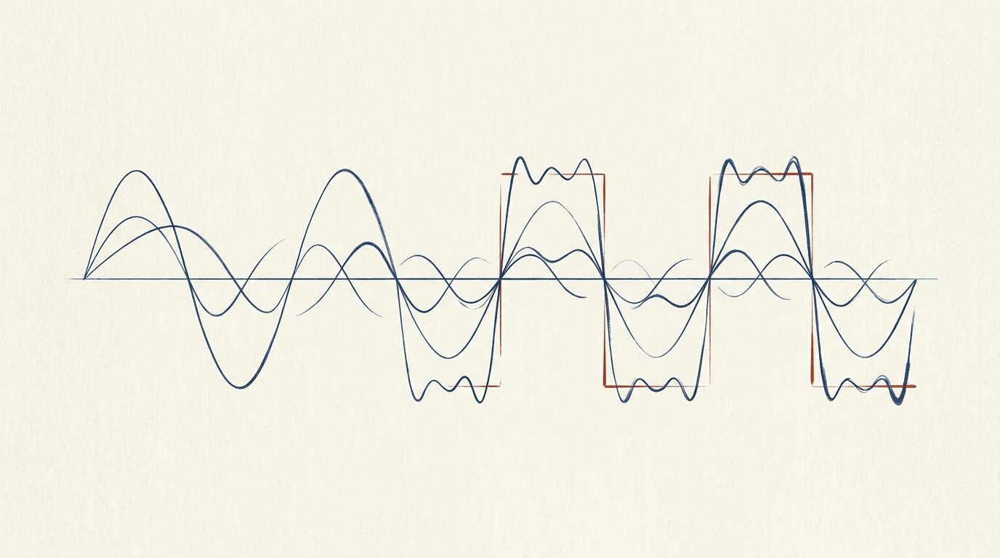

<!-- mdlog:v1 s=gallery-demo -->

> **你** · 22:10
>
> 把你能画的图都展示一遍——流程图、架构图、交互图、图片，我要看看效果。

<!-- mdlog:m=aa000001 -->

<p class="mdlog-who"><strong>Pi</strong> · 22:11</p>

**其一 · 静态架构图**——系统的三层组织（靛青=界面层、黛绿=运行时、赭石=持久层）：

```vellum-widget
<!DOCTYPE html>
<html lang="zh-CN">
<head>
<meta charset="UTF-8"><title>图 1 · Vellum 三层架构</title>
<style>
  body { margin:0; padding:14px; background:#f5f4ed; }
  .frame { background:#faf9f5; padding:14px 10px 6px; }
  svg { width:100%; height:auto; display:block; }
  text { font-family:"TsangerJinKai02","Source Han Serif SC","Songti SC",serif; }
  .t1 { font-size:15px; fill:#141413; font-weight:500; }
  .t2 { font-size:13px; fill:#3d3d3a; }
  .t3 { font-size:12.5px; fill:#6b6a64; }
  .cap { font-size:12.5px; color:#6b6a64; text-align:center; padding:8px 0 6px; border-top:1px solid #dddacc; margin-top:10px; }
</style>
</head>
<body>
<div class="frame">
<svg viewBox="0 0 640 300">
  <rect x="40" y="18" width="560" height="72" fill="none" stroke="#1B365D" stroke-width="1.5"/>
  <text x="60" y="44" class="t1">前端 · React 19（WebView2）</text>
  <text x="60" y="68" class="t3">MarkdownDocument 懒加载 · CodeBlock PrismLight · WidgetSandbox memo+LRU</text>
  <line x1="320" y1="90" x2="320" y2="118" stroke="#3d3d3a" stroke-width="1" stroke-dasharray="4 3"/>
  <text x="336" y="108" class="t3">invoke / emit</text>
  <rect x="40" y="118" width="268" height="72" fill="none" stroke="#2F5D50" stroke-width="1.5"/>
  <text x="60" y="144" class="t1">Rust 后端 · Tauri 2</text>
  <text x="60" y="168" class="t3">read_document · watch · widget 注册表</text>
  <rect x="332" y="118" width="268" height="72" fill="none" stroke="#8C5B2E" stroke-width="1.5"/>
  <text x="352" y="144" class="t1">本地文件系统</text>
  <text x="352" y="168" class="t3">.md 文档 · mdlog-assets 图片</text>
  <line x1="40" y1="214" x2="600" y2="214" stroke="#dddacc" stroke-width="1"/>
  <text x="40" y="240" class="t2">数据单向流动：磁盘 → 后端 → 前端；事件反向推送热重载</text>
  <text x="40" y="264" class="t3">配色：靛青=界面层，黛绿=运行时，赭石=持久层（kami 基调 + 语义色）</text>
</svg>
<div class="cap">图 1 · 三层架构与数据流向（静态）</div>
</div>
<script>
  (function() {
    function report() {
      const h = Math.ceil(document.documentElement.getBoundingClientRect().height);
      window.parent.postMessage({ type: "vellum-widget:resize", height: h, title: document.title }, "*");
    }
    window.addEventListener("load", report);
    if (window.ResizeObserver) new ResizeObserver(report).observe(document.body);
  })();
</script>
</body>
</html>
```

**其二 · 静态流程图**——打开一篇文档时的判定流程：

```vellum-widget
<!DOCTYPE html>
<html lang="zh-CN">
<head>
<meta charset="UTF-8"><title>图 2 · 文档加载判定流程</title>
<style>
  body { margin:0; padding:14px; background:#f5f4ed; }
  .frame { background:#faf9f5; padding:14px 10px 6px; }
  svg { width:100%; height:auto; display:block; }
  text { font-family:"TsangerJinKai02","Source Han Serif SC","Songti SC",serif; }
  .n { font-size:13.5px; fill:#141413; }
  .e { font-size:12.5px; fill:#6b6a64; }
  .cap { font-size:12.5px; color:#6b6a64; text-align:center; padding:8px 0 6px; border-top:1px solid #dddacc; margin-top:10px; }
</style>
</head>
<body>
<div class="frame">
<svg viewBox="0 0 640 330">
  <defs>
    <marker id="arw" viewBox="0 0 10 10" refX="9" refY="5" markerWidth="7" markerHeight="7" orient="auto-start-reverse">
      <path d="M0,0 L10,5 L0,10" fill="none" stroke="#6b6a64" stroke-width="1.4"/>
    </marker>
  </defs>
  <rect x="220" y="14" width="200" height="40" fill="none" stroke="#1B365D" stroke-width="1.5"/>
  <text x="320" y="39" text-anchor="middle" class="n">读取文件字节</text>
  <line x1="320" y1="54" x2="320" y2="76" stroke="#6b6a64" stroke-width="1.2" marker-end="url(#arw)"/>
  <polygon points="320,78 460,118 320,158 180,118" fill="none" stroke="#8C5B2E" stroke-width="1.5"/>
  <text x="320" y="113" text-anchor="middle" class="n">含 mdlog:v1 指纹？</text>
  <text x="320" y="133" text-anchor="middle" class="e">（前 512KB 预检）</text>
  <line x1="180" y1="118" x2="90" y2="118" stroke="#6b6a64" stroke-width="1.2"/>
  <line x1="90" y1="118" x2="90" y2="196" stroke="#6b6a64" stroke-width="1.2" marker-end="url(#arw)"/>
  <text x="130" y="100" text-anchor="middle" class="e">否</text>
  <line x1="320" y1="158" x2="320" y2="196" stroke="#6b6a64" stroke-width="1.2" marker-end="url(#arw)"/>
  <text x="344" y="182" class="e">是</text>
  <rect x="14" y="198" width="220" height="52" fill="none" stroke="#3d3d3a" stroke-width="1.2"/>
  <text x="124" y="220" text-anchor="middle" class="n">普通文档管线</text>
  <text x="124" y="239" text-anchor="middle" class="e">widget 需点击授权加载</text>
  <rect x="240" y="198" width="260" height="52" fill="none" stroke="#2F5D50" stroke-width="1.5"/>
  <text x="370" y="220" text-anchor="middle" class="n">受信 mdlog 管线</text>
  <text x="370" y="239" text-anchor="middle" class="e">widget 自动挂载 · 书札版式</text>
  <line x1="124" y1="250" x2="124" y2="278" stroke="#6b6a64" stroke-width="1.2"/>
  <line x1="370" y1="250" x2="370" y2="278" stroke="#6b6a64" stroke-width="1.2"/>
  <line x1="124" y1="278" x2="370" y2="278" stroke="#6b6a64" stroke-width="1.2"/>
  <line x1="247" y1="278" x2="247" y2="298" stroke="#6b6a64" stroke-width="1.2" marker-end="url(#arw)"/>
  <rect x="147" y="300" width="200" height="26" fill="none" stroke="#1B365D" stroke-width="1.2"/>
  <text x="247" y="318" text-anchor="middle" class="n">渲染 + 文件监听热重载</text>
</svg>
<div class="cap">图 2 · 指纹判定决定渲染管线（静态）</div>
</div>
<script>
  (function() {
    function report() {
      const h = Math.ceil(document.documentElement.getBoundingClientRect().height);
      window.parent.postMessage({ type: "vellum-widget:resize", height: h, title: document.title }, "*");
    }
    window.addEventListener("load", report);
    if (window.ResizeObserver) new ResizeObserver(report).observe(document.body);
  })();
</script>
</body>
</html>
```

**其三 · 交互演示**——拖动谐波项数 N，看方波如何被逐阶逼近（这类「参数探索」才值得交互）：

```vellum-widget
<!DOCTYPE html>
<html lang="zh-CN">
<head>
<meta charset="UTF-8"><title>图 3 · 方波谐波合成（可交互）</title>
<style>
  body { margin:0; padding:14px; background:#f5f4ed; color:#3d3d3a; font-family:"TsangerJinKai02","Source Han Serif SC","Songti SC",serif; font-size:15px; }
  .frame { background:#faf9f5; padding:14px 16px 6px; }
  .row { display:flex; align-items:center; gap:12px; margin-bottom:10px; font-size:13.5px; }
  .row b { font-weight:500; color:#141413; min-width:88px; }
  .val { font-family:"JetBrains Mono",Consolas,monospace; font-size:13px; color:#1B365D; min-width:30px; }
  input[type=range] { -webkit-appearance:none; appearance:none; flex:1; height:4px; background:#dddacc; border-radius:2px; outline:none; }
  input[type=range]::-webkit-slider-thumb { -webkit-appearance:none; width:12px; height:12px; border-radius:2px; background:#1B365D; cursor:pointer; border:1px solid #faf9f5; }
  canvas { display:block; width:100%; height:150px; }
  .note { font-size:12.5px; color:#6b6a64; font-family:"JetBrains Mono",Consolas,monospace; border-left:2px solid #1B365D; padding:4px 10px; background:#f5f4ed; margin-top:10px; }
  .cap { font-size:12.5px; color:#6b6a64; text-align:center; padding:8px 0 6px; border-top:1px solid #dddacc; margin-top:10px; }
  @media (prefers-reduced-motion: reduce) { *,*::before,*::after { animation:none !important; transition:none !important; } }
</style>
</head>
<body>
<div class="frame">
  <div class="row"><b>谐波项数 N</b><input type="range" id="n" min="1" max="15" step="1" value="5"><span class="val" id="vn">5</span></div>
  <canvas id="c"></canvas>
  <div class="note" id="f">f(t) = (4/π) · Σ sin((2k-1)t)/(2k-1)，k ∈ [1, 5]</div>
  <div class="cap">图 3 · 拖动 N 感受吉布斯现象（交互）</div>
</div>
<script>
  (function() {
    function report() {
      const h = Math.ceil(document.documentElement.getBoundingClientRect().height);
      window.parent.postMessage({ type: "vellum-widget:resize", height: h, title: document.title }, "*");
    }
    window.addEventListener("load", report);
    if (window.ResizeObserver) new ResizeObserver(report).observe(document.body);

    const c = document.getElementById('c'), ctx = c.getContext('2d');
    const input = document.getElementById('n'), vn = document.getElementById('vn'), f = document.getElementById('f');
    let N = 5;
    function draw() {
      const r = c.getBoundingClientRect();
      c.width = r.width; c.height = r.height;
      const midY = c.height / 2, amp = c.height * 0.38, period = c.width / 2;
      ctx.clearRect(0, 0, c.width, c.height);
      ctx.strokeStyle = '#dddacc'; ctx.lineWidth = 1; ctx.setLineDash([3,3]);
      ctx.beginPath(); ctx.moveTo(0, midY); ctx.lineTo(c.width, midY); ctx.stroke(); ctx.setLineDash([]);
      ctx.strokeStyle = '#e8e6dc'; ctx.lineWidth = 1; ctx.beginPath();
      for (let x = 0; x < c.width; x++) {
        const t = (x / period) * 2 * Math.PI;
        const y = midY - (Math.sin(t) >= 0 ? 1 : -1) * amp;
        x === 0 ? ctx.moveTo(x, y) : ctx.lineTo(x, y);
      }
      ctx.stroke();
      ctx.strokeStyle = '#1B365D'; ctx.lineWidth = 1.8; ctx.beginPath();
      for (let x = 0; x < c.width; x++) {
        const t = (x / period) * 2 * Math.PI; let s = 0;
        for (let k = 1; k <= N; k++) s += Math.sin((2*k-1)*t) / (2*k-1);
        const y = midY - s * (4/Math.PI) * amp;
        x === 0 ? ctx.moveTo(x, y) : ctx.lineTo(x, y);
      }
      ctx.stroke();
    }
    input.addEventListener('input', () => {
      N = parseInt(input.value, 10);
      vn.textContent = N;
      f.textContent = `f(t) = (4/π) · Σ sin((2k-1)t)/(2k-1)，k ∈ [1, ${N}]`;
      draw();
    });
    window.addEventListener('resize', draw);
    draw();
  })();
</script>
</body>
</html>
```

**其四 · 生成图片**——水墨风格的谐波合成示意（由图像模型生成，经 `mdlog-assets/` 落盘引用）：



四种形态各有分工：架构/流程用**静态 SVG**（精确、克制、改起来快）；参数演化用**交互块**；氛围与直觉示意用**生成图片**。你评判哪种该多用、哪种该少用。
