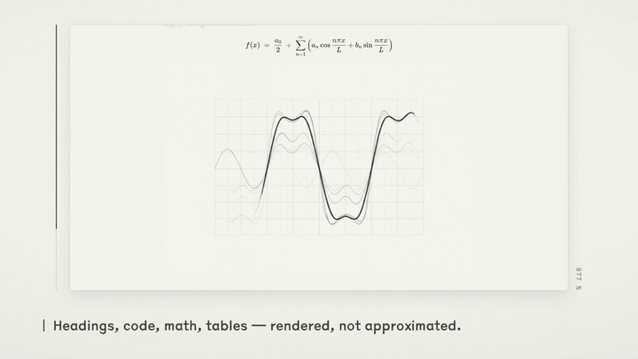

# 发布文案

配套 `promo/assets/` 里那套素材用的文字。口径与 `DESIGN.md`、宣传片、README 一致，
改口径时四处一起改（片子里的文案单一来源是 `video/src/theme.ts`）。

## 一句话

> **Vellum · 素笺 —— 给 Markdown 一张纸。**

## 三句话

> 暖纸底色、今楷正文、一笔靛青。没有行号栏，没有分屏，没有侧边工具架——
> 只有一个把长文档认真排出来的窗口。
> Windows 上免费开源，7 MB，离线可用。

## 长版本（首段可直接用于 Release / 落地页）

> 读长文档时，眼睛真正需要的东西很少：稳定的版心、安静的层级、一处可点的强调色。
> Vellum 把这些从纸的排印规则里捡回来——14px / 1.55 行高 / 0.4px 字距的正文，
> 靠字号与留白而不是框线划分层级，一整页里只有一种彩色。
>
> 它同时是个称手的工具：左侧大纲随文滚动、`Ctrl+K` 全文检索、`Ctrl+E` 块级就地编辑，
> 以及给 agent 用的现场日志（mdlog）与沙箱交互块——文档被追加时它不抢你的滚动位置，
> 没有变化的块也不会重打一遍。

## GitHub Release 正文（草案）

```markdown
## Vellum · 素笺 1.7.0

暖纸底色、今楷正文、一笔靛青的 Windows Markdown 阅读器。



30 秒宣传片：[promo/assets/vellum-promo.mp4](../promo/assets/vellum-promo.mp4) ·
落地页：[promo/index.html](../promo/index.html)

### 本次亮点

- **多实例**：双击几个 .md 就开几个窗口，各自加载各自的文档；不再把新开的文件转发给首个实例
- **编辑视图 A2「页边字符」**：正文与阅读视图完全一致，编辑信号全在页边——
  hover 淡 `¶`、只读块常驻灰 `×`、激活块一道靛青边轨加 `¶`
- **交互块只需点一次**：沙箱交互块的授权按源码指纹落盘，换文档、热重载、重启应用都记得
- **开关侧栏不再「闪到别处」**：改宽度会让整篇重排，而 Chromium 的原生滚动锚定
  不补偿这种重排（真机实测位移 3652px → 修复后 0–1px），现在由应用自己钉住视口
- **文档内锚点可用**：`[文字](#id)` 由应用接管，缓动滚过去并顺带点亮大纲

### 安装

- `素笺_1.7.0_x64_en-US.msi` —— 系统级 / 受管设备
- `素笺_1.7.0_x64-setup.exe` —— 单用户轻量安装

两者都会注册 `.md` / `.markdown` 文件关联。Windows 10 1809+ / 11，x64，需要 WebView2。

### 许可

MIT · 离线可用 · 无账号无云

_Built for focused reading._
```

## 社交短文案

- **一行版（≤80 字）**：给 Markdown 一张纸。暖纸底色、今楷正文、一笔靛青的 Windows 阅读器，
  7 MB，开源离线。长文大纲、全文检索、块级就地编辑，还有给 agent 写文档用的现场日志。
  → 配 `promo/assets/poster-title.jpg`
- **细节版（≤200 字，适合 V2EX / 少数派那种要交代来由的场景）**：
  做这个的起因是拿现成编辑器读长 md 时，注意力总被界面吃掉。于是把版心、字距、层级
  按纸的排印规则重做了一遍：正文 14px / 1.55 / 0.4px 字距，层级只靠字号与留白，
  整页只有一种彩色（占比 ≤5%）。功能上该有的都在——大纲跟随、全文检索、就地编辑、
  KaTeX、20 种语言高亮，以及文档尾部实时追加的 agent 现场日志。
  Windows 10/11，MIT，离线。→ 配 `promo/assets/vellum-promo.gif`
- **技术向（给做 Tauri / 前端性能的老哥）**：
  Tauri 2 + React 19 的 Markdown 阅读器，7 MB 安装包。性能上做了几件不太常见的事：
  开关侧栏改宽会整篇重排而 Chromium 原生滚动锚定不补偿，所以自己按视口锚点逐帧钉住；
  阅读位置用「标题锚点 → 顶层块序号 → 比例」三级记录并在布局稳定前持续重锚；
  沙箱交互块全局最多 10 个存活、离屏停帧。仓库里有对应的 CDP 真机探针。
  → 配 `promo/assets/window-reading.png`

## 素材搭配

中英各一套，文件同名只差 `-zh` 后缀。

### 中文渠道

| 场景 | 用哪件 |
|------|--------|
| 帖子 / 图床 | `assets/vellum-promo-zh.gif`（8.5 秒循环） |
| 发布页 / 论坛正文 | `assets/vellum-promo-zh.mp4`（30 秒） |
| 微信 / 朋友圈、B 站封面 | `assets/poster-title-zh.jpg` / `poster-rendering-zh.jpg` |
| 分享卡（1280×640） | `assets/social-preview-zh.png` |
| 功能配图 | `assets/window-*-zh.png` |

中文版值得单独说一句的：片中的文档、大纲、编辑面、交互块**都是中文的**
（截图来自中文演示文档 `纸的界面.md`），不是拿英文界面配中文字幕。

### 英文渠道

| 场景 | 用哪件 |
|------|--------|
| 仓库首页 / 分享卡 | `assets/social-preview.png`（1280×640） |
| README / 社交贴 | `assets/vellum-promo.gif` |
| 发布页 | `assets/vellum-promo.mp4` |
| 图床贴图 | `assets/poster-*.jpg`（1920×1080） |
| 功能配图 | `assets/window-*.png`（2880×1800） |

## 不要说的话

- 不承诺平台支持之外的东西（目前只有 Windows 10/11 x64 构建与实测）。
- 不说「比 XX 更好」——设计语言取自 [Kami](https://github.com/tw93/kami)，
  Credits 里已经写明来由，宣传口径里保持这个分寸。
- 「7 MB 安装包」指 NSIS 单用户安装包，别写成「7 MB 程序」。
