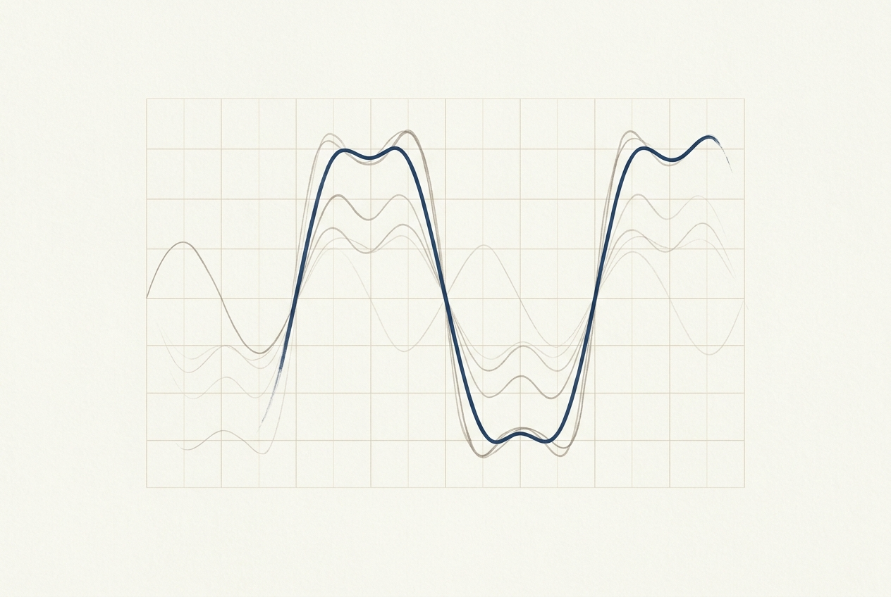

# The Paper Interface

A screen is a light source. Paper is a surface. Everything below is an attempt to
make a Markdown file feel like the second thing.

> Good typography is invisible. You notice it only when it is gone — when the
> line length fights the eye, or the heading weight shouts where it should speak.

## Why Paper

Reading is a low-bandwidth act with a high-bandwidth cost. The eye moves in
saccades, the saccades need a stable rhythm, and that rhythm is broken by
everything that is not the text: chrome, gutters, cards, borders, gradients.

So the interface removes them. Structure is carried by four things only —
`font-size`, `font-weight`, whitespace, and a 3% luminance step between
`parchment` and `ivory`. There is exactly one accent colour, used on ≤ 5% of the
page, and it is never used to fill.

### What stays

- A hairline separator where a group ends and another begins
- The outline, which is a map of the document and nothing more
- Inline code, because it is a different material and should look like one
- Footnotes, folded to the margin until you ask for them

## Typography

### The type scale

| Element | Size | Weight | Line height |
| --- | --- | --- | --- |
| `h1` | 30px | 500 | 1.2 |
| `h2` | 21px | 500 | 1.25 |
| `h3` | 17px | 500 | 1.3 |
| body | 14px | 400 | 1.55 |
| code | 12px | 400 | 1.5 |

Weight 500 is the ceiling. A kai serif at 700 stops being a voice and becomes a
block — the hierarchy has to come from size and air instead.

### Letter spacing

Chinese text wants tracking; Latin text at the same size wants none. The body
therefore sits at `0.4px` of letter spacing, and the serif only shows up for
headings, quotes, and anything the reader is meant to *read* rather than scan.

- [x] Serif for prose
- [x] Mono for code, counters, and keyboard hints
- [ ] A third family, ever

## The Rendering Pipeline

A document is parsed once into an MDAST, sanitized, then handed to the same
blocks the editor uses.

```ts
type EditUnit = {
  index: number;
  start: number;
  end: number;
  editable: boolean;
};

export function buildEditUnits(source: string): EditUnit[] {
  const tree = fromMarkdown(source, { extensions: [gfm()] });
  return flatten(tree).map((node, index) => ({
    index,
    start: node.position!.start.offset!,
    end: node.position!.end.offset!,
    // Structural containers stay read-only: splicing a list item would
    // desynchronise the offsets of every unit after it.
    editable: isLeafBlock(node),
  }));
}
```

The Rust side does the unglamorous half — path resolution, encoding detection,
and a watcher that fires only when the bytes on disk actually differ from what
the editor last wrote back.

```rust
pub fn save_document(path: &Path, markdown: &str) -> Result<(), String> {
    if mdlog_is_live()? {
        return Err("mdlog session in progress".into());
    }
    let tmp = path.with_extension("md.tmp");
    fs::write(&tmp, markdown.as_bytes()).map_err(io_err)?;
    fs::rename(&tmp, path).map_err(io_err)
}
```

## Mathematics

Inline math is guarded against the currency trap — `$5 and $10` stays money,
while $e^{i\pi} + 1 = 0$ renders. Display math gets its own column:

$$
f(x) \;=\; \frac{a_0}{2} \;+\; \sum_{n=1}^{\infty}\left(a_n\cos\frac{n\pi x}{L} + b_n\sin\frac{n\pi x}{L}\right)
$$



## Live Sessions

A document is not always finished by a human. When an agent writes to the file,
Vellum follows the tail without stealing the scroll position — and never
re-typesets a block that has not changed.

```vellum-widget
<!DOCTYPE html>
<html lang="en">
<head>
<meta charset="utf-8">
<title>Rendering pipeline</title>
<style>
  :root {
    --parchment: #f5f4ed; --ivory: #faf9f5; --warm-sand: #e8e6dc;
    --near-black: #141413; --dark-warm: #3d3d3a; --stone: #6b6a64;
    --brand: #1B365D; --hairline: #dddacc; --border: #e8e6dc;
    --font-serif: "TsangerJinKai02", "Source Han Serif SC", "Noto Serif CJK SC", Georgia, serif;
    --font-mono: "JetBrains Mono", "SF Mono", Consolas, monospace;
  }
  * { box-sizing: border-box; }
  body {
    margin: 0; padding: 14px 16px; background: var(--ivory);
    font-family: var(--font-serif); color: var(--dark-warm); font-size: 15px;
  }
  svg { display: block; width: 100%; height: auto; }
  .label { font-size: 13px; fill: var(--near-black); }
  .sub { font-size: 11.5px; fill: var(--stone); font-family: var(--font-mono); }
  .box { fill: var(--parchment); stroke: var(--border); stroke-width: 1; rx: 4; }
  .edge { stroke: var(--hairline); stroke-width: 1.2; fill: none; }
  .accent { stroke: var(--brand); }
  @media (prefers-reduced-motion: reduce) { * { animation: none !important; } }
</style>
</head>
<body>
  <svg viewBox="0 0 700 150" role="img" aria-label="Rendering pipeline">
    <rect class="box" x="8"   y="45" width="120" height="48"></rect>
    <text class="label" x="68"  y="68" text-anchor="middle">Markdown</text>
    <text class="sub"   x="68"  y="84" text-anchor="middle">.md</text>

    <rect class="box" x="170" y="45" width="120" height="48"></rect>
    <text class="label" x="230" y="68" text-anchor="middle">MDAST</text>
    <text class="sub"   x="230" y="84" text-anchor="middle">parse once</text>

    <rect class="box" x="332" y="45" width="120" height="48"></rect>
    <text class="label" x="392" y="68" text-anchor="middle">Blocks</text>
    <text class="sub"   x="392" y="84" text-anchor="middle">edit units</text>

    <rect class="box" x="494" y="45" width="120" height="48"></rect>
    <text class="label" x="554" y="68" text-anchor="middle">Paper</text>
    <text class="sub"   x="554" y="84" text-anchor="middle">render</text>

    <path class="edge" d="M128 69 H 170"></path>
    <path class="edge" d="M290 69 H 332"></path>
    <path class="edge" d="M452 69 H 494"></path>
    <path class="edge accent" d="M554 93 V 124 H 68 V 93"></path>
    <text class="sub" x="311" y="140" text-anchor="middle">save back, offsets preserved</text>
  </svg>
<script>
  (function() {
    function report() {
      const h = Math.ceil(document.documentElement.getBoundingClientRect().height);
      window.parent.postMessage({
        type: "vellum-widget:resize",
        height: h,
        title: document.title
      }, "*");
    }
    window.addEventListener("load", report);
    if (window.ResizeObserver) {
      new ResizeObserver(report).observe(document.body);
    }
  })();
</script>
</body>
</html>
```

## Reading Position

A long document is a place, not a stream. Position is remembered as a heading
anchor first, a top-level block index second, and a scroll ratio only as a
fallback[^ratio] — because the ratio is the one that lies when images finish
loading underneath you.

[^ratio]: Falling back to `scrollTop / scrollHeight` is correct exactly once:
    at the very top of a document that has no headings and no block structure.
